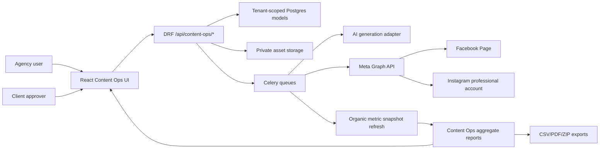
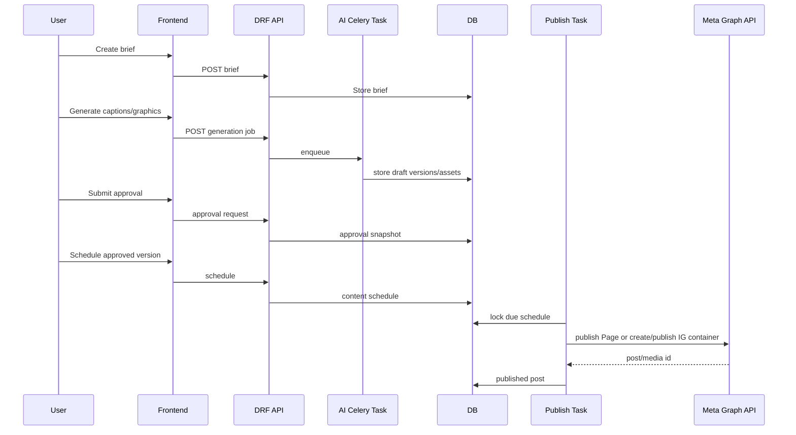

# Content Operations Architecture and Sprint Plan

Status: active implementation plan
Related spec: `docs/project/content-operations-meta-publishing-spec.md`
Ticket backlog: `docs/project/content-operations-implementation-backlog.md`
Timezone baseline: `America/Jamaica`
Last updated: 2026-06-06

## Purpose

Turn the Content Operations proposal into an architecture, sprint plan, reviewer workflow, and
agent-friendly execution map that can be coded safely in isolated ADinsights slices.

This document is the active coding plan for the cross-stream Content Operations program. The backend
foundation, caption generation foundation, safe scheduler queue, fakeable Facebook Page processor,
and aggregate/export surfaces now exist. Concrete ticket IDs, dependencies, acceptance criteria,
and repo-ready versus external-blocked scope live in
`docs/project/content-operations-implementation-backlog.md`.

## Architecture Summary

Content Operations adds one new product module with five bounded subsystems:

1. Planning: workspaces, briefs, content calendars, brand profiles.
2. AI production: caption generation, graphic generation, redaction, evals, asset storage.
3. Approvals: internal review, client review, immutable approval snapshots.
4. Publishing: app-owned schedule, Meta Page publishing, Instagram container publishing.
5. Reporting: published-post linkage, aggregate organic metrics, exports.

Keep these subsystem boundaries explicit. Do not bury publishing, AI, and reporting inside the
existing Meta onboarding code.

## System Context



## Backend Components

| Component | Proposed module | Owns | Reviewer |
| --------- | --------------- | ---- | -------- |
| Models/migrations | `backend/content_ops/models.py` | workspace, brief, asset, draft, approval, schedule, attempt, published post, metric snapshot | Sofia + Raj |
| Serializers | `backend/content_ops/serializers.py` | additive DRF contracts and enum validation | Sofia |
| Views/routes | `backend/content_ops/views.py`, `urls.py` | `/api/content-ops/*` | Sofia + Lina |
| AI generation services | `backend/content_ops/generation.py` | caption jobs, schema validation, redaction, fakeable provider boundary, eval hooks | Sofia + Nina |
| Asset service | `backend/content_ops/assets.py` | private storage, renditions, temporary public fetch URLs | Nina + Victor |
| Publisher | `backend/content_ops/publisher.py` | Page preflight, fakeable Page attempt processing, safe error mapping | Maya + Leo |
| Scheduler tasks | `backend/content_ops/tasks.py` | due scan, locks, dispatch, retries, metric refresh | Leo + Omar |
| Permissions | `backend/content_ops/permissions.py` | strategist/internal/client/operator/viewer access | Sofia + Nina |
| Audit/events | existing audit/logging helpers | approval and publish trace | Omar + Hannah |

The `backend/content_ops/` app boundary is now implemented and remains architecture-sensitive until
Raj/Mira complete review. Future slices should stay within one top-level folder unless Raj
coordinates a cross-stream PR.

## Current Implementation Reality

Implemented:

- tenant-scoped Content Ops backend app, models, serializers, routes, permissions, readiness axes,
  workflow actions, aggregate reports, and JSON content-plan export
- queued caption-generation endpoint and fakeable disabled-by-default caption processor
- safe due-schedule dispatch queue records, retry requeue, queue filters, and fakeable Facebook Page
  attempt processor

Partial:

- audit event catalog coverage
- persisted export artifacts/downloads
- aggregate reporting over stored rows only
- Facebook Page publishing processor without live Graph adapter
- Instagram container lifecycle without live Graph adapter
- frontend Content Ops screen with partial live API/mock fallback wiring
- every-minute due-schedule, retryable-attempt, and queued-attempt processor beat scans
- organic metric refresh worker over already-synced Meta post insight rows

Not implemented:

- live OpenAI/API provider calls
- AI graphic generation
- live Facebook Graph publishing
- dbt organic marts

## Next Slice Order

1. Goal H / `CO-2*` continuation: polish the Content Ops frontend route, including export history,
   calendar/client review depth, retry/reporting affordances, and state mapping.
2. `CO-0C` operational proof: confirm deployable storage/CDN/proxy URL behavior before graphics or
   live Instagram media publishing.
3. `CO-3C`: add disabled-by-default graphic generation foundation after asset proof.
4. `CO-5A`/`CO-5F`: complete Meta App Review docs/evidence before live publishing.
5. `CO-5C-live`: add live Facebook Page adapter only after evidence gates pass.

Completed recent planning/build-control slices:

- `CO-SPEC-AUDIT`: reconciled specs, tickets, prompts, reviewer routing, and release gates.
- `CO-3E`: added golden caption eval harness and tenant-safe fixtures.
- `CO-8A-lite`: added caption-generation active job and rolling 24-hour quota guardrails.

## Frontend Components

| Screen | Route idea | Purpose | Reviewer |
| ------ | ---------- | ------- | -------- |
| Calendar/queue | `/content` | first screen, production calendar, publish queue | Lina |
| Brief builder | `/content/briefs/:id` | brand, audience, offer, generation constraints | Lina + Joel |
| Draft editor | `/content/drafts/:id` | platform variants, captions, media, version history | Lina + Joel |
| Asset library | `/content/assets` | generated/uploaded graphics and renditions | Joel |
| Approval queue | `/content/approvals` | internal/client decisions | Lina |
| Client review | `/content/review/:id` or tenant-auth route | restricted approval surface | Lina + Nina |
| Readiness panel | embedded in content shell | separate Meta auth/Page/IG/publishing/reporting blockers | Lina + Maya |
| Reports | `/content/reports` | aggregate organic performance and exports | Lina + Sofia |

Frontend should ship against mocked contracts first, then swap to real API clients after backend
contract tests pass.

## Celery and Orchestration Design

Add two queue classes only after load is known. MVP can reuse `summary` for AI/export jobs and
`sync` for Meta publishing, but production should split them:

| Queue | Work | Concurrency default | Notes |
| ----- | ---- | ------------------- | ----- |
| `content_ai` | caption and graphic generation | 1-2 | cost and rate-limit controlled |
| `content_publish` | due scans, publish attempts, metric refresh | 2 | idempotent and lock-based |

Beat entries:

- `content-publish-due-scan`: every minute, checks due schedules.
- `content-publish-retry-scan`: every minute, checks retryable attempts.
- `content-publish-process-scan`: every minute, processes queued attempts through disabled-by-default
  provider boundaries.
- `content-organic-metrics-refresh`: hourly at minute 35 from 06:00-22:00, refreshes recent
  published posts from already-synced aggregate Meta post insight rows.
- `content-readiness-refresh`: hourly 06:00-22:00, refreshes publishing identity readiness.

Task rules:

- Every task uses tenant context.
- Every task logs `tenant_id`, `task_id`, `correlation_id`, `schedule_id` or `generation_job_id`.
- Publishing uses `select_for_update(skip_locked=True)` and idempotency keys.
- Instagram containers are created only near publish time.
- Retries use exponential backoff base 2, max five attempts, with jitter.
- Terminal errors are safe reason codes, not raw Meta payload dumps.

## Data Flow



## Sprint Plan

### Sprint 0: Architecture and Governance

Goal: close design ambiguity before code.

| Task | Owner | Output | Done when |
| ---- | ----- | ------ | --------- |
| Confirm Meta permission family | Maya + Raj | permission decision note | catalog/profile update queued |
| Confirm asset URL strategy | Nina + Victor | storage/CDN/proxy decision | staging-feasible URL path known |
| Confirm backend app boundary | Sofia + Mira | architecture note | route/model location agreed |
| Confirm frontend IA | Lina + Joel | route/component map | mock contract list agreed |
| Confirm eval harness | Sofia + Omar | eval fixture plan | golden set paths agreed |

Tests: docs-only, guardrail checks.

### Sprint 1: Backend Contract Skeleton

Goal: make the contract real without publishing.

| Task | Owner | Scope | Tests |
| ---- | ----- | ----- | ----- |
| Add content ops app/models | Sofia | `backend/` | `make backend-lint && make backend-test` |
| Add serializers/viewsets/OpenAPI | Sofia | `backend/` | OpenAPI path tests |
| Add permissions/audit events | Nina + Sofia | `backend/` | permission + tenant isolation tests |
| Add readiness composition endpoint | Maya + Sofia | `backend/` | readiness separation tests |

Reviewers: Raj, Sofia, Nina, Maya.

### Sprint 2: Frontend Mocked Workspace

Goal: make the agency workflow usable before integrations.

| Task | Owner | Scope | Tests |
| ---- | ----- | ----- | ----- |
| Content shell/calendar | Lina | `frontend/src/` | frontend guardrails/lint/test/build |
| Brief and draft editor | Lina + Joel | `frontend/src/` | component/integration tests |
| Approval queue/client review | Lina + Nina | `frontend/src/` | role-state tests |
| Readiness panel | Lina + Maya | `frontend/src/` | mocked matrix tests |

Reviewers: Lina, Joel, Raj for contract alignment.

### Sprint 3: AI Production

Goal: generate client-ready drafts and graphics with evals.

| Task | Owner | Scope | Tests |
| ---- | ----- | ----- | ----- |
| Caption structured output adapter | Sofia | `backend/` | schema and redaction tests |
| Graphic generation job | Sofia + Joel | `backend/` | asset persistence/dimension tests |
| Prompt redaction | Nina | `backend/` | no-secret tests |
| Eval fixture set | Omar + Sofia | `backend/`/docs evidence | local eval tests |
| Generation UI | Lina | `frontend/src/` | job state tests |

Reviewers: Sofia, Nina, Lina, Omar.

### Sprint 4: Approval and Export

Goal: make the module valuable without live publishing.

| Task | Owner | Scope | Tests |
| ---- | ----- | ----- | ----- |
| Immutable approval snapshots | Sofia | `backend/` | version drift tests |
| Client approval UX | Lina | `frontend/src/` | role and accessibility tests |
| Calendar/export artifacts | Sofia + Lina | backend/frontend split | export snapshot tests |
| Notification hooks | Hannah + Omar | backend/docs split | alert/runbook checks |

Reviewers: Sofia, Lina, Hannah.

### Sprint 5: Facebook Page Publishing MVP

Goal: publish approved Page posts from ADinsights-owned schedule.

| Task | Owner | Scope | Tests |
| ---- | ----- | ----- | ----- |
| Page publishing preflight | Maya | `backend/` | permission/readiness tests |
| Page publisher service | Maya + Leo | `backend/` | safe error/idempotency tests |
| Publish scheduler | Leo | `backend/` | duplicate-dispatch tests |
| Publish queue UI | Lina | `frontend/src/` | state/retry tests |
| App Review evidence | Hannah + Maya | `docs/` | evidence checklist |

Reviewers: Raj, Maya, Leo, Sofia, Lina.

### Sprint 6: Aggregate Organic Reporting

Goal: connect published posts to aggregate reporting.

| Task | Owner | Scope | Tests |
| ---- | ----- | ----- | ----- |
| Published post metric snapshots | Sofia | `backend/analytics` or `backend/content_ops` | aggregate-only tests |
| Content report endpoints | Sofia | `backend/` | tenant scoping tests |
| Content report UI | Lina | `frontend/src/` | frontend tests |
| Optional dbt design note | Priya | `docs/` then `dbt/` later | dbt only when implemented |

Reviewers: Sofia, Priya, Lina, Raj.

### Sprint 7: Instagram Beta

Goal: publish approved Instagram feed posts safely.

| Task | Owner | Scope | Tests |
| ---- | ----- | ----- | ----- |
| IG publishing readiness | Maya | `backend/` | linkage/permission tests |
| Media URL validation | Nina + Maya | `backend/` | content-type/size tests |
| Container create/poll/publish | Leo + Maya | `backend/` | expiry/retry tests |
| IG queue states UI | Lina | `frontend/src/` | mocked state tests |
| IG App Review evidence | Hannah | `docs/` | validation checklist |

Reviewers: Raj, Maya, Leo, Nina, Lina.

### Sprint 8: Production Hardening

Goal: make rollout safe tenant by tenant.

| Task | Owner | Scope | Tests |
| ---- | ----- | ----- | ----- |
| Quotas and cost controls | Nina + Sofia | `backend/` | quota tests |
| Ops dashboards/alerts | Omar + Hannah | docs/backend split | observability smoke |
| Runbooks and rollback | Hannah + Mei | `docs/runbooks/` | docs review |
| Release preflight | Raj + Mei | all touched slices | `make adinsights-preflight` |

Reviewers: Raj, Mira, stream owners.

## Agentic Work Packets

Use these as copy/paste prompts for coding agents.

### Backend Data Packet

```text
Implement only the backend data foundation for Content Operations.
Read AGENTS.md, docs/workstreams.md, docs/project/content-operations-meta-publishing-spec.md, and
docs/project/content-operations-architecture-sprint-plan.md.
Scope: backend only.
Do:
- add tenant-scoped models/migrations for workspace, brief, generation job, media asset, draft,
  draft version, approval request/decision, schedule, publish attempt, published post, and metric
  snapshot
- add focused model tests for tenant isolation, approval snapshots, idempotency keys, and aggregate
  metric grain
Do not:
- add frontend code
- call Meta
- call AI providers
- change existing Meta readiness contracts
Verify: make backend-lint && make backend-test.
```

### Frontend Mock Packet

```text
Implement only the mocked frontend Content Operations workspace.
Scope: frontend/src only.
Do:
- add content calendar, brief editor, draft editor, approval queue, readiness panel, and publish
  queue using mocked API fixtures/types
- ensure readiness states stay separate
- ensure buttons disable based on exact blockers
Do not:
- change backend contracts
- add real Meta calls
Verify: make frontend-guardrails && make frontend-lint && make frontend-test && make frontend-build.
```

### Scheduler Packet

```text
Implement only the Content Operations publishing scheduler.
Scope: backend only.
Do:
- add due schedule scanner, lock handling, per-channel publish attempts, retries with jitter,
  idempotency keys, and structured logs
- implement service interfaces for Facebook Page and Instagram publishing but keep external calls
  mockable in tests
- prove duplicate dispatch cannot publish twice
Do not:
- add frontend code
- add dbt marts
Verify: make backend-lint && make backend-test; run strict observability smoke if task metrics changed.
```

### Reporting Packet

```text
Implement only aggregate Content Operations reporting.
Scope: backend/analytics or agreed backend content_ops reporting module.
Do:
- link PublishedPost records to aggregate metric snapshots
- expose tenant-scoped overview/posts endpoints
- reject user-level fields in serializers/tests
- keep organic and paid Meta metrics labeled separately
Do not:
- add dbt marts unless the API snapshot contract is already reviewed
Verify: backend metrics tests and contract guard.
```

## Architecture Review Checklist

- States are separated: auth, Page selection, Instagram linkage, Facebook publishing readiness,
  Instagram publishing readiness, reporting readiness.
- Every model has tenant scope or is deliberately global and documented.
- Every task sets tenant context.
- Every external request has safe timeout, retry policy, and sanitized error mapping.
- Every publish attempt is idempotent.
- Instagram containers are not created before the near-publish window.
- Assets are private at rest and public only through short-lived publish URLs.
- Approval snapshots bind exact version and media IDs.
- Edits after approval invalidate approval.
- Reports are aggregate-only.
- Paid and organic reporting are not blended without labels.
- AI prompts are redacted and logs do not include prompt text by default.
- Evals exist before model/provider tuning.
- App Review evidence exists before enabling publishing scopes.

## Simulated Reviewer Feedback

Raj: The module is cross-stream by design. Keep docs, backend, frontend, scheduler, and reporting in
separate PRs unless a coordinated integration PR is explicitly approved. The riskiest contract is
the readiness surface because it can accidentally blur existing Meta reporting readiness.

Mira: Use a bounded `content_ops` domain. Do not refactor the existing Meta integration stack just to
fit publishing. Shared scheduler helpers are acceptable only after duplicate logic appears.

Sofia: DRF serializers need strict enum handling and omission/null semantics. Publish and reporting
errors must be machine-readable and client-safe. Add OpenAPI tests before frontend consumes the API.

Maya: Meta publishing should be a separate service from asset discovery/reporting. Revalidate the
current Graph API version and permission family before runtime scope changes.

Leo: Scheduler correctness is the release blocker. Prove skip-locked behavior, idempotency, retries,
and container expiry with tests before touching real Meta credentials.

Lina: The UX must start from the production calendar and queue. Readiness blockers need to be
actionable and separate. The client approval view must be exact and boring, not clever.

Joel: Generated graphics need predictable aspect-ratio frames and thumbnails. Avoid nested card-heavy
layouts in the editor; this is an operations surface.

Nina: AI prompts, Meta tokens, signed asset URLs, and provider errors are all leakage risks. Redact by
default and test logs.

Omar/Hannah: Add queue latency, publish outcome, generation cost, and failure reason metrics. Runbooks
must cover expired containers, failed asset fetches, revoked tokens, App Review gaps, and rate limits.

Priya/Martin: Do not rush dbt marts. Stabilize API aggregate snapshots first, then promote to marts
with clear organic paid labels.

## Reviewer Scorecards

| Reviewer | Must confirm before approval |
| -------- | ---------------------------- |
| Raj/Mira | Slice stays single-folder or has explicit cross-stream coordination; architecture docs match implementation; no broad refactor is hidden in feature work. |
| Sofia | DRF contracts, serializer omission/null semantics, tenant filters, OpenAPI coverage, and machine-readable safe errors are current. |
| Maya/Leo | Meta auth/Page/IG/reporting states remain separate; Celery state transitions, retries, idempotency, and disabled provider boundaries are deterministic. |
| Nina/Victor | Tokens, prompts, signed URLs, provider payloads, and failure details cannot leak; asset URL strategy has deployment proof before IG media work. |
| Lina/Joel | Frontend work starts from calendar/queue/editor workflows with mocked contracts; readiness blockers remain separate and controls have stable responsive states. |
| Omar/Hannah | Evals, structured logs, failure codes, runbooks, and evidence artifacts are actionable without exposing secrets. |
| Priya/Martin | Organic reporting stays aggregate-only and labeled separately from paid reporting; dbt marts wait for stable API snapshots and beta evidence. |
| Mei | Rollback, release checklist, and preflight evidence are explicit before production activation. |

## Documentation To Maintain During Implementation

- `docs/runbooks/content-operations-publishing.md`
- `docs/runbooks/content-operations-app-review.md`
- `docs/runbooks/content-operations-failures.md`
- `docs/project/content-operations-api-contract.md`
- `docs/project/content-operations-eval-plan.md`
- `docs/project/evidence/content-operations/<timestamp>.md`
- Feature flag entries in `docs/project/feature-flags-reference.md`
- Permission updates in `docs/project/meta-permission-profile.md`
- API contract changes in `docs/project/api-contract-changelog.md`

## Definition of Ready

An implementation slice is ready when:

- Owner and reviewer are named.
- Top-level folder scope is explicit.
- Contract surface is linked.
- Test command is listed.
- Feature flag behavior is defined.
- Rollback behavior is known.
- App Review or external dependency is either complete or not needed for the slice.

## Definition of Done

An implementation slice is done when:

- Tests for the touched folder pass or failures are documented as unrelated.
- Tenant isolation is tested where data is added.
- Structured logs are safe.
- Contract docs are updated if an API/data contract changed.
- Runbooks are updated if behavior or operations changed.
- Reviewer scorecard items are satisfied.
- Activity log has a one-line entry.
